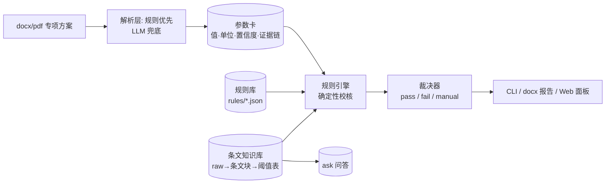

# PlanGuard（方案卫士）

> 危大工程专项施工方案智能审查系统 —— 挑战赛道赛题 1「工程大模型 Agent 智能应用系统设计」· 主题 1
>
> **规则优先 + LLM 兜底**：方案文档（docx/pdf）解析为结构化"参数卡"，与机器可读的规范规则库做确定性合规校核；每条结论挂依据条款与原文证据，多值冲突不硬判、输出"待人工确认"。

🚧 **当前状态：M6 脱敏发布完成（v0.1.0，M1–M6 全部收官）** —— `check` 端到端审查（md+docx 报告）、`ask` 条文问答、LLM 兜底抽取（防幻觉三件套）、Web 审查面板（断网可演示）、两个基准脚本（零 API 可复现）；发布自检见 [plan/06-交付对标.md](plan/06-交付对标.md) §3。

## 为什么做

危大工程（深基坑、高支模、起重吊装等）专项施工方案审查存在**方案体量大、人工审查效率低、依赖专家经验、易漏审错审、审查标准不统一**五大痛点。PlanGuard 把"专家经验"固化为机器可读规则库，用确定性规则引擎秒级校核，审查结论全部可追溯到规范条款与方案原文。

## 核心特性

| 特性 | 状态 |
| --- | --- |
| 统一中间表示（参数卡：值·单位·文本取值·置信度·证据链） | ✅ 已实现 |
| 规则引擎（required / threshold / within_range / enum / conditional_program / checklist_section，结论挂依据） | ✅ 全量可用 |
| 内置规则库（深基坑 20 + 高支模 10 条：阈值/漏项/枚举/程序性/章节齐套，示例阈值标注待核对） | ✅ M3/M5 |
| docx/pdf 方案解析器 + 参数提取（别名归一/伪空格/超范围丢弃/页码证据） | ✅ 已实现 |
| 端到端流水线 + 审查报告（Markdown + 可归档 docx 含签署栏；三级结论/证据/建议） | ✅ M3/M5 |
| 条文知识库三层（raw 来源登记 / 条文块 43 块 / 阈值表 41 条，全部标注待核对） | ✅ M4/M5 |
| 条文问答 `ask`（L3 阈值表结构化命中直答，否则 L2 条文检索 top-k，零依赖中文检索） | ✅ M4 |
| LLM 兜底抽取（防幻觉三件套：候选行压缩/摘录子串校验/范围校验；失败自动降级纯规则） | ✅ M4 |
| 配对真值数据生成器（40 份合成样例 = 深基坑30+高支模10，80 处注入差异 + also_expect 真值全集） | ✅ M2–M5 |
| 内置基准评测（解析 F1=1.0 / 端到端检出率 100%·误报 0，零 API 可复现） | ✅ M4/M5 |
| Web 审查面板（上传 → 流水线进度 → 在线三级结论报告 + 条文问答；FastAPI + 本地 vendor Vue3，断网可演示） | ✅ M5 |

## 架构



设计原则：**数值结论永远来自确定性规则**，LLM 只做兜底抽取与行文；每条结论必须携带证据链，可解释、可复现。

## 快速开始

环境：Windows / Python ≥3.8（核心链路零第三方依赖）。

```bash
# 骨架端到端演示：内置样例参数卡 × 样例规则 → 三级结论
py -m planguard demo

# 解析真实方案 docx → 参数卡 JSON（需 python-docx）
py -m pip install -i https://pypi.tuna.tsinghua.edu.cn/simple python-docx
py -m planguard parse data/samples/gen_0001.docx

# 端到端审查：方案 → 29 条规则校核 → Markdown + docx（可归档，含签署栏）报告
py -m planguard check data/samples/gen_0001.docx --report output
# 退出码: 0 通过/待确认；1 存在不合规

# Web 审查面板（断网可演示：Vue3 为本地 vendor 文件，无 CDN）
py -m pip install -i https://pypi.tuna.tsinghua.edu.cn/simple -e ".[web]"
py -X utf8 -m uvicorn planguard.web.app:create_app --factory --port 8000
# 浏览器打开 http://127.0.0.1:8000 → 上传方案 → 在线三级结论报告 + 条文问答

# LLM 兜底抽取（可选）：配置 .env（见 .env.example），规则提取未命中的参数
# 由 LLM 兜底（摘录必须为原文子串，超范围丢弃，失败自动降级纯规则）
py -m planguard check data/samples/gen_0001.docx --report output --llm

# 条文知识库问答：L3 阈值表命中直接回答，否则 L2 条文检索
py -m planguard ask "基坑开挖深度超过多少需要专家论证"

# 重新生成配对真值样例语料（可复现：固定 seed；默认深基坑30 + 高支模10 = 40 份）
py scripts/make_gold.py --count 30 --fs-count 10 --seed 2026

# 内置基准评测（零 API）：解析 F1 / 端到端检出率·误报率 → 指标表
py benchmarks/run_all.py

# 查看版本与模块状态 / 内置规则库
py -m planguard info
py -m planguard rules

# 运行测试（核心用例零依赖；docx 用例需 python-docx）
py -m unittest discover -v
```

## 目录结构

```
├── plan/          # 计划文档（需求解读/架构/详设/数据/里程碑/交付对标）
├── data/          # 数据四目录 + 来源许可台账（samples/intermediate/knowledge/gold）
├── planguard/     # 主包（ir/parsers/extract/rules/knowledge/llm/report/web）
├── tests/         # unittest 测试（81 项，全绿）
├── scripts/       # make_gold.py 配对真值数据生成器
├── benchmarks/    # 基准评测（eval_parse / eval_e2e / run_all，results.json）
└── pyproject.toml # 依赖分层：parse / llm / web extras
```

## 评测

生成样例语料上零 API 可复现（`py benchmarks/run_all.py`，seed=2026；2026-09-27 实测）：

| 基准 | 指标 | 结果 | 目标 |
| --- | --- | --- | --- |
| 参数解析（字段级，40 份生成样例 = 深基坑30+高支模10） | P / R / F1 | 1.0000 / 1.0000 / **1.0000** | F1 ≥ 0.95 ✅ |
| 端到端合规核查（80 处注入差异） | 检出率 / 强制误报 | 100.0%（80/80） / **0** | 100% / 0 ✅ |

## 限制

- **类目覆盖有限**：目前仅深基坑、高支模两类目共 29 条规则；起重吊装、脚手架、拆除等其他危大工程类目未覆盖（新类目按 only_if_text 门控扩展，见 plan/04）。
- **知识库为要点打样**：条文块 43 块、阈值表 41 条均为"要点+出处"形式并标注"待核对"，未收录规范全文；检索是零依赖字符 bigram 余弦（非语义检索），长尾问法可能召回不准。
- **解析器面向文本型 docx/pdf**：扫描件（图片型 PDF）、复杂嵌套表格、图纸内容无法提取参数。
- **基准基于合成语料**：40 份样例 / 80 处注入差异均为程序化合成（seed 可复现），真实工程方案表述多样性远超模板，指标不能直接外推到真实数据。
- **LLM 兜底依赖外部服务**：需联网与 `.env` 密钥；断网/欠费/超时自动降级纯规则，未提取到的参数转入"待人工确认"，不会编造数值。
- **平台**：开发与验证均在 Windows（Python 3.8）；Linux/macOS 未做适配测试。

## 路线图

M1 计划+骨架 ✅ → M2 解析层+数据 ✅ → M3 规则全量+端到端 ✅ → M4 知识库+LLM+评测 ✅ → M5 Web+报告+高支模 ✅ → M6 脱敏发布 ✅。详见 [plan/05-里程碑.md](plan/05-里程碑.md)。

## 免责声明

- 内置规则、知识库条文与阈值均为**示例值/要点整理**，标注"待核对"，以官方现行规范文本为准；
- 本工具辅助预审，**不替代专家论证**；最终结论以人工审查为准；
- 样例数据均为程序化自制，不含真实项目信息。

## 已知环境问题（Windows）

个别机器（本仓库开发机实测）Python 写入 `__pycache__` 字节码时偶发损坏，表现为运行/测试随机 `SystemError: unknown opcode` 甚至段错误。对策——禁止写字节码后运行：

```bash
PYTHONDONTWRITEBYTECODE=1 py -m unittest discover
PYTHONDONTWRITEBYTECODE=1 py -m planguard check 方案.docx
```

若频繁出现，建议检查磁盘健康与杀毒软件对 Python 目录的实时扫描。

**Git 推送**：本仓库已配置 `http.proxy=127.0.0.1:7897`（本机代理）。2026-09-27 实测：代理未开启时**直连推送同样可用**，此时用：

```bash
git -c http.proxy= -c https.proxy= push
```

推送失败先重试，再切换直连。

## License

[MIT](LICENSE)
