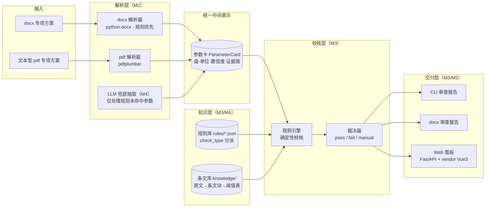

# 02 架构与技术选型

## 1. 总体架构



## 2. 五条核心设计决策

1. **统一中间表示（参数卡）**：所有解析结果归一到"参数卡"（实体-属性-值-单位-置信度-证据）。合规比对问题被归约为「参数卡 × 规则表」的结构化匹配，方案侧与规范侧完全解耦，新增规范只加规则不加代码。
2. **规则优先，LLM 只兜底**：数值结论永远来自确定性规则。LLM 仅承担三件事：规则未覆盖参数的抽取兜底、参数别名归一、报告行文润色。这保证了可解释性与评测可重复性。
3. **证据链强制**：每张参数卡、每条结论都携带 evidence（文档/章节/页码/原文行）。结论分三级：合规 / 不合规 / **待人工确认**——多值冲突、低置信度一律不硬判。
4. **评测内建**：配对数据生成器（程序化生成方案 + 注入已知差异 + 真值 JSON）+ 两个基准脚本（解析 F1、端到端检出率/误报率），零 API 依赖可重复。指标进 README 作为项目可信度证据。
5. **免构建交付**：Web 面板用 FastAPI + 本地 vendor 的 Vue3/PDF.js（npmmirror 下载入 vendor 目录），演示不依赖 CDN/外网；CLI 一条命令端到端。

## 3. 技术选型

| 领域 | 选型 | 理由 | 备选 |
| --- | --- | --- | --- |
| 语言 | Python ≥3.8 | 目标机 Windows + py3.8.8（本机实测） | — |
| docx 解析 | python-docx | 纯 Python，可直接遍历段落/表格 | mammoth |
| pdf 解析 | pdfplumber | 文本型 pdf 提取文字+坐标，支撑证据定位 | pypdf |
| LLM | OpenAI 兼容接口的国内模型（qwen / GLM 系列） | 国内可达；`enable_thinking=false` 可关闭思考模式大幅提速 | — |
| 条文检索 | jieba 分词 + TF 余弦（纯 Python） | 条文规模数百条，不值得引 faiss/向量库 | bm25 |
| Web | FastAPI + vendor Vue3（免构建） | 演示现场不依赖外网 | Flask + Jinja |
| 报告导出 | python-docx（与解析同栈） | 生成审查报告 docx，签署栏可用 | pandoc |
| 测试 | unittest（stdlib）为主 | py3.8 自带，零依赖可跑；pytest 可选 | pytest |
| 分发 | pyproject.toml + `py -m planguard` 免安装运行 | clone 即可演示 | — |

**依赖分层**（随里程碑安装，避免一次性引入风险）：

- core（M0，已就绪）：stdlib only —— IR、规则引擎、CLI、unittest
- parse（M2）：`pip install -e .[parse]` —— python-docx、pdfplumber
- llm（M4）：`pip install -e .[llm]` —— openai 兼容客户端
- web（M5）：`pip install -e .[web]` —— fastapi、uvicorn

## 4. 目录结构（骨架已建立）

```
├── plan/                    # 计划文档（本目录）
├── data/                    # 数据四目录 + 台账 README
│   ├── samples/             # 方案样本（自制）
│   ├── intermediate/        # 中间格式样例
│   ├── knowledge/           # raw 原文 / blocks 条文块 / thresholds 阈值表
│   └── gold/                # 配对真值样例
├── planguard/               # 主包（核心链路零第三方依赖）
│   ├── ir/                  # 统一中间表示（参数卡/证据/结论）
│   ├── parsers/             # docx/pdf 解析器（M2）
│   ├── rules/               # 规则引擎 + rules/data/*.json 规则库
│   ├── knowledge/           # 条文库与检索（M4）
│   ├── llm/                 # LLM 兜底客户端（M4）
│   ├── report/              # 报告导出（M3/M5）
│   ├── orchestrator.py      # 端到端流水线（M3）
│   ├── cli.py               # 命令行入口
│   └── web/                 # FastAPI 面板（M5）
├── tests/                   # unittest 测试
├── scripts/                 # make_gold.py 配对数据生成器等
├── benchmarks/              # 基准评测脚本（M4）
├── pyproject.toml           # 依赖分层 + planguard 入口
└── README.md
```

## 5. 数据流示例（实现验收锚点）

**输入原文**（"六、施工安全保证措施 / 6.3 监测方案"，第 25 页）：

> 支护结构顶部水平位移控制值为 35mm。

**解析（M2）** → 参数卡：

```json
{
  "param_id": "dp.retaining.displacement",
  "name": "支护结构顶部水平位移控制值",
  "value": 35.0, "unit": "mm", "raw_text": "35mm",
  "category": "deep_pit", "confidence": 1.0, "source": "rule",
  "evidence": {
    "doc": "XX项目基坑支护方案.docx",
    "section": "六、施工安全保证措施/6.3 监测方案",
    "page": 25,
    "line_text": "支护结构顶部水平位移控制值为35mm。"
  }
}
```

**校核（M3）** → 命中规则 R-DP-021（threshold_max，控制值 ≤30mm，依据 GB 50497-2019 监测报警值要求）：

```json
{
  "rule_id": "R-DP-021", "result": "fail",
  "detail": "实测 35.0mm，要求 <= 30.0mm",
  "basis": "GB 50497-2019 监测报警值要求（示例阈值，以官方文本为准）",
  "advice": "位移控制值实测 35.0mm，超过上限 30.0mm；请复核监测报警值取值并与设计文件核对。",
  "evidence_line": "支护结构顶部水平位移控制值为35mm。"
}
```

**程序性规则示例（M4 启用，条件类）**：原文"基坑开挖深度为 5.4m" → 规则 R-DP-101「开挖深度 ≥5m 属超过一定规模的危大工程，须组织专家论证」→ 若全文未检出"专家论证"章节/表述 → 结论 fail + 建议补充论证程序材料。

## 6. 工程约定（Windows + py3.8 陷阱对策）

- 用 `py` 而非 `python`（后者是商店占位符）；控制台输出统一 `-X utf8`，CLI 内部对 stdout/stderr 做 `reconfigure(encoding="utf-8")`
- 脚本文件代替超长 `python -c` 内联（中文易踩 GBK 编码）
- Git Bash 与 Windows Python 路径混用时一律使用工作区相对路径或 `Path(__file__).resolve()`
- 网络类操作必带超时与重试；pip 用清华镜像；模型/API 走国内可达端点
- 每个里程碑收口标准：全量 unittest 绿 + demo/check 演示命令可跑 + plan/05 的 DoD 逐条勾掉
